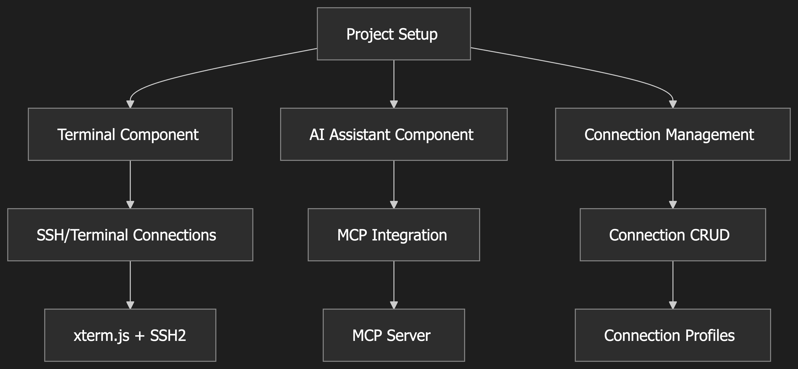

# TermAI

TermAI is a Tauri app with a Svelte frontend that provides a terminal interface with AI capabilities. It allows users to interact with a command-line environment and get assistance from an AI assistant.

## Architecture Overview

TermAI consists of three main components:

1.  **Terminal Component:** Provides the core terminal functionality, including SSH connections and terminal sessions.
2.  **AI Assistant (MCP Integration):** Integrates with a custom MCP server to provide AI-powered features such as chat, command suggestions, and technical explanations.
3.  **Connection Management:** Manages SSH connection profiles, terminal session settings, and MCP server configurations.



## Component Details

### 1. Terminal Component

-   **Core Features:**
    -   SSH connections using `ssh2`
    -   Terminal sessions via `xterm-addon-attach`
    -   Resizable terminal interface
-   **Dependencies:**
    -   `xterm@5.3.0`
    -   `xterm-addon-fit@5.3.0`
    -   `xterm-addon-attach@0.8.0`
    -   `ssh2@1.11.0`

### 2. AI Assistant (MCP Integration)

-   **MCP Endpoints:**
    -   `/chat`: AI conversation interface
    -   `/suggest`: Command suggestions
    -   `/explain`: Technical explanations
-   **Dependencies:**
    -   `@mcp/core@latest`
    -   Custom MCP server setup

### 3. Connection Management

-   **Features:**
    -   SSH connection profiles
    -   Terminal session settings
    -   MCP server configuration
-   **Storage:**
    -   Local encrypted storage
    -   Connection history

## Implementation Phases

1.  **Core Terminal Setup** (Week 1)
    -   xterm.js integration (Partially Implemented)
    -   Basic SSH connection (Started)
2.  **MCP Integration** (Week 2)
    -   MCP server setup
    -   AI chat interface (Done visually, but not functional)
    -   Command suggestion system (Not Implemented)
3.  **Connection Management** (Week 3)
    -   Profile creation/editing (Partially Implemented)
    -   Connection history (Not Clear)
    -   Settings persistence (Not Clear)
4.  **Polish & Testing** (Week 4)
    -   UI refinements
    -   Security review
    -   Performance optimization

## Getting Started

### Prerequisites

-   [Node.js](https://nodejs.org/)
-   [npm](https://www.npmjs.com/) or [pnpm](https://pnpm.io/) or [Yarn](https://yarnpkg.com/)
-   [Tauri CLI](https://tauri.app/v1/guides/getting-started/prerequisites)

### Installation

1.  Clone the repository:

    ```bash
    git clone [https://github.com/MrAntonS/TermAI]
    ```

2.  Install dependencies:

    ```bash
    npm install
    # or
    pnpm install
    # or
    yarn install
    ```

### Development

To start the development server:

```bash
npm run dev
```

### Building

To create a production version of the app:

```bash
npm run build
```

## Usage

### Terminal

The terminal interface allows you to interact with a command-line environment. You can type commands and see the output in the terminal.

Currently, the terminal supports the following commands:

-   `show ip int br` or `show ip int brief`: Displays the status of network interfaces.

### AI Assistant

The AI assistant provides suggestions and explanations to help you understand the information. You can ask questions and receive responses from the AI assistant.

## Acknowledgements

-   [Tauri](https://tauri.app/)
-   [Svelte](https://svelte.dev/)
-   [Xterm.js](https://xtermjs.org/)

## TODO

-   Implement real AI integration
-   Add more terminal commands
-   Improve the UI
-   Add more features
